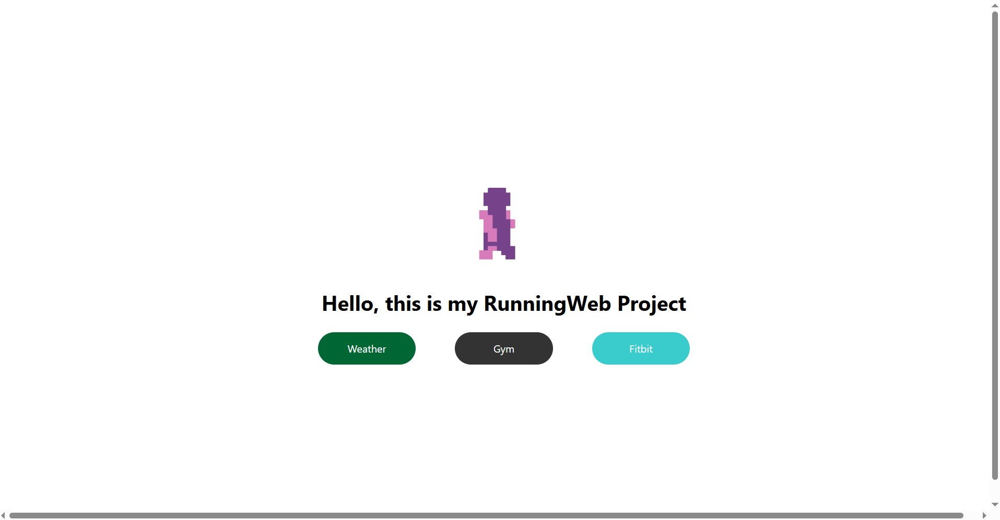
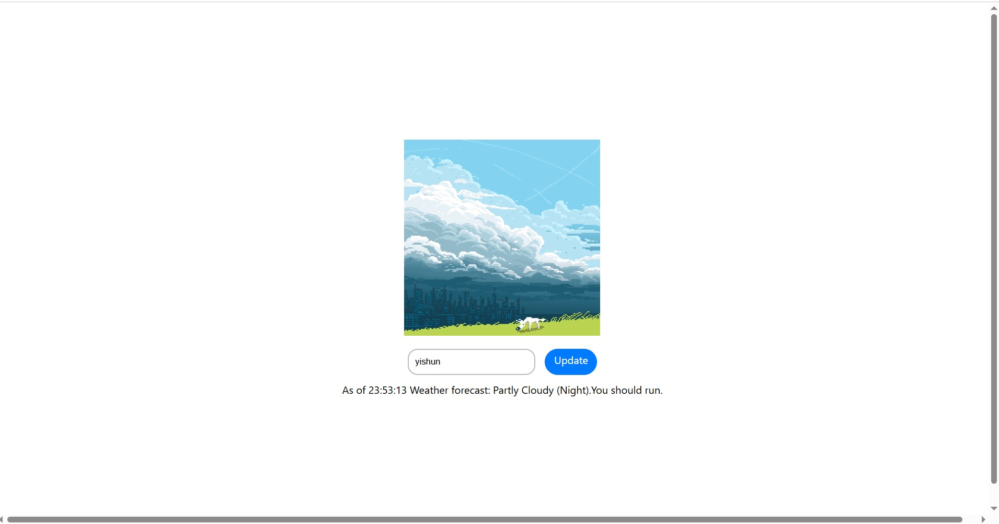
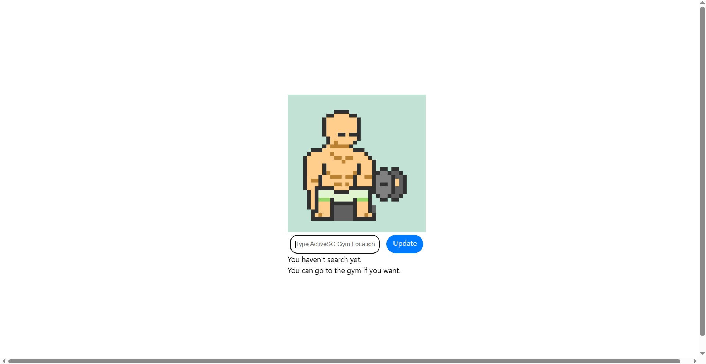
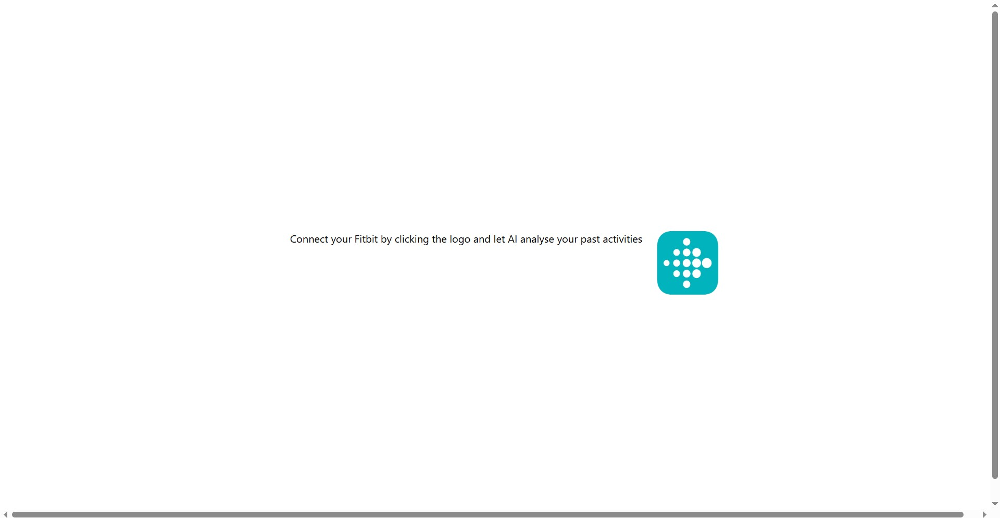
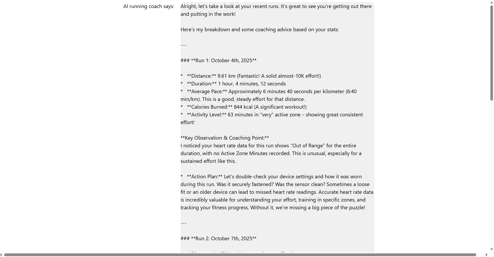

# **My RunningWeb Project**

A mini full-stack web app built with **React and Spring Boot**

## **Overview**

* **Weather Tracker** - Displays whether it is optimal to go for a run right now based on NEA 2Hr weather forecast API
* **Gym Capacity Tracker** - Displays ActiveSG Gym Capacity based on their facilities API
* **Fitbit Data Analyser** - Connects to Fitbit API (OAuth 2.0) and uses Gemini 2.5 Flash AI API to analyse your activity data

## **Project Structure**
'frontend/' - React Code (VSCode)

'backend/' - Spring Boot code (Intellij)

### **How to run locally**

1.) Make sure you have java JDK installed

2.) Install NodeJS

3.) Intellij with maven

4.) VSCode

5.) Git

Clone the repo, setup API keys in backend Intellij using:

DATA_GOV_API_KEY = your data.gov.sg key 

GEMINI_API_KEY = your google ai cloud key

run frontend on vscode and backend on intellij

frontend will be accessible via localhost:5173 on vite

### **Images Of Application** 

   
   
   
   
   

